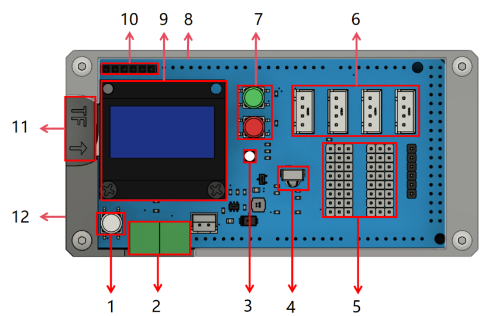
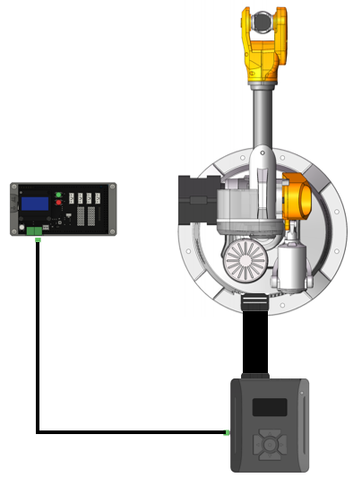

# Overview of Arduino MEGA 2560 Controller
The Arduino MEGA 2560 controller (hereinafter referred to as MEGA 2560) is a high-performance learning and development board based on the Arduino series of controllers. The MEGA 2560 includes multiple communication interfaces and sensors, and adds many anti fooling interface designs. It integrates learning and development. If a multifunctional controller is used for communication, RS485, UART, WIFI, and Bluetooth can be used for communication.
## MEGA 2560 onboard function description

<div style="text-align: center;">
  
</div>


  1. RST - Restart button;
  2. RS485 interface, using UART1;
  3. RGB light R uses 58 pins, G uses 57 pins, and B uses 59 pins;
  4. Infrared receiving module, using GPIO56;
  5. GPIO, with pin colors representing red positive, black negative, white/blue signals, including RST, digital pins 2-8, and analog pins A8-A15;
  6. UART3/UART2/UART1/IIC;
  7. On board buttons, red buttons use GPIO3, green buttons use GPIO2, and internal pull-up mode is required for use;
  8. Active buzzer, using A6 pin;
  9. OLED screen, using IIC.
  10. UART2 interface, used to connect Bluetooth and WIFI modules;
  11. TF card interface, using SPI;
  12. Power pin, can be connected to a 12V power supply.
## Wiring instructions for MEGA 2560 controller RS485
<div style="text-align: center;">
  
</div>

## Example

Using a Mirabot robotic arm for homing
```c++
#include "WLKATA.h"

Mirobot_UART mirobot1;

void rs485_error(String sendStr, int address) {
    Serial.println("Unable to connect to device " + String(address));
}

void setup() {
    Serial.begin(115200);
    Serial.println("\r\nInit");
  
	RS485.begin(38400);	// Set baud rate
	RS485.setOutTimeFunction(rs485_error); // Set the communication timeout period and callback function
    mirobot1.init(1);  // Set device address
	
	Serial.println("Start");
	
  // The default homing does not include a 6th axis and an extension axis
    Serial.println("Device homing ...");
    mirobot1.homing();
    while(mirobot1.getState() != Idle);	// Wait for homing to end
     Serial.println("End of homing");

/*
  // Only the 6th axis homing
  // Note: Some versions of the device do not have a sixth axis sensor and will fail home
  Serial.println("AxisEX homing ...");
  mirobot1.homing(AxisEX);
  while(mirobot1.getState() != Idle); // Wait for homing to end
  Serial.println("AxisEX homing is complete");
*/

/*
  // Only the expansion axis homing
  // Note: If the extension axis homing, the motor and limit sensor must be connected
  Serial.println("Axis6 homing ...");
  mirobot1.homing(Axis6);
  while(mirobot1.getState() != Idle); // Wait for homing to end
  Serial.println("Axis6 homing is complete");
*/
}
void loop() {
}
```
Mirobot robotic arm executes offline files
```c++
#include "WLKATA.h"

Mirobot_UART mirobot1;

void rs485_error(String sendStr, int address) {
    Serial.println("Unable to connect to device " + String(address));
}

void setup() {
    Serial.begin(115200);
    Serial.println("\r\nInit");
  
	RS485.begin(38400);	// Set baud rate
	RS485.setOutTimeFunction(rs485_error); // Set the communication timeout period and callback function
    mirobot1.init(1);  // Set device address
	
	Serial.println("Start");
	
  // Device homing if the status is Alarm
    if(mirobot1.getState() == Alarm){
        Serial.println("Device homing ...");
        mirobot1.homing();
  }
	
        Serial.println("Run file test");
        mirobot1.runFile("test");// Run the test.gcode file
        mirobot1.waitIdle();
        Serial.println("Run out");
}

void loop() {

}

```
